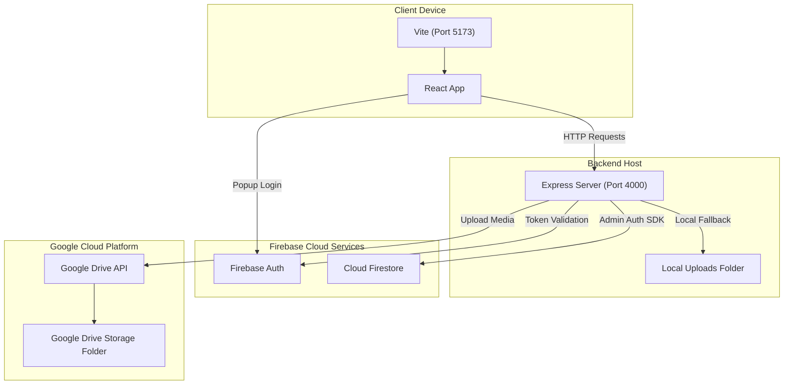
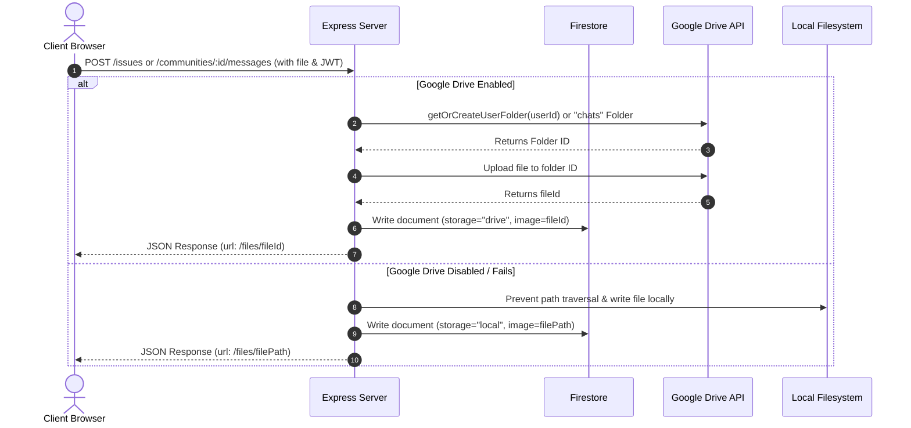

# Programming Practice & Q&A Set

## Question 1
**Q:** What causes the `5 NOT_FOUND` (gRPC `NOT_FOUND`) error when attempting to query or write to a Cloud Firestore database using the Firebase Admin SDK in Node.js, and how can it be resolved?

**A:** 
The `5 NOT_FOUND` error occurs when the Firebase Admin SDK successfully authenticates with Google Cloud/Firebase services, but the specific Firestore database instance you are trying to access does not exist. 

### Common Causes:
1. **Database Not Created:** In new Firebase projects, the Cloud Firestore database is not initialized by default.
2. **Incorrect Project ID:** The service account credentials or environment variables (`FIREBASE_PROJECT_ID`) are pointing to a different project or a placeholder project name that does not have Firestore enabled.
3. **Incorrect Database ID:** The Admin SDK is trying to connect to the `(default)` database, but the project uses a named database (or vice versa).

### Solution:
1. Go to the [Firebase Console](https://console.firebase.google.com/).
2. Select your project.
3. In the left-hand navigation panel, click on **Firestore Database**.
4. Click **Create database**, select your database location, and configure the security rules (start in test mode for local development).
5. Ensure your `.env` and `serviceAccountKey.json` files contain the correct `project_id`, `private_key`, and `client_email` for your active Firebase project.

---

## Question 2
**Q:** Why does the profile page in the frontend React app get stuck on "Loading profile..." when the backend Firestore database fails to connect, and how can the UI/UX be improved to handle this?

**A:** 
On the frontend page, data fetching is executed inside a `useEffect` hook that requests `/users/me`. If the database is not initialized, the request fails, causing the API client promise to reject. 

### Cause:
In the component, there is a conditional rendering check:
```javascript
if (!profile) return <p className="text-slate-600">Loading profile...</p>;
```
Because `profile` is only set when the API request succeeds, any API failure results in `profile` remaining `null`, locking the page on the loading screen and preventing the user from seeing the error message logged to the `msg` state.

### Solution:
Refactor the loading check to render the error message if the `msg` state is populated:
```javascript
if (!profile) {
  return (
    <div>
      {msg ? <ErrorMessage text={msg} /> : <p>Loading profile...</p>}
    </div>
  );
}
```
This ensures the user is informed of the failure (such as a database connection error) and can take troubleshooting actions instead of looking at a frozen loading indicator.

---

## Question 3
**Q:** How can you implement a robust fallback storage system in Node.js when an external storage service (like Google Drive API) fails or is not fully configured?

**A:** 
You can implement transparent local filesystem fallback handlers:

1. **Upload Handler:** Wrap the external upload logic in a try-catch block. If it fails, write the file buffer locally (e.g., in a local `backend/uploads` directory using `fs.promises.writeFile`) and return a file ID marked as local.
2. **Stream Handler:** First inspect if the requested file ID exists locally (e.g., using `fs.existsSync`). If it does, return a read stream for the local file using `fs.createReadStream`. If not, fall back to requesting the file stream from the external service.
3. **Delete Handler:** Check if the file is stored locally first; if so, delete it from the local directory. Otherwise, make the call to delete it from the external storage API.

This design makes storage failures transparent to the rest of the application.

---

## Question 4
**Q:** When designing community/group invitation models in fullstack web applications, what is a key UX check for invite-code/token-based access, and how do you resolve it?

**A:** 
In token-based or invite-code-based join systems, it is common to implement the backend check (verifying the token when a user joins) and the frontend prompt (allowing the user to type in a code). However, a frequent UX gap is failing to display the code to current members or admins after they have joined. To resolve this, the community card UI should conditionally render the invite code for authorized members, allowing them to copy and share it with new prospective members.

---

## Question 5
**Q:** What causes the `9 FAILED_PRECONDITION: The query requires an index` error in Firestore, and how can it be bypassed in code for minor/development setups without building composite indexes in the Firebase Console?

**A:** 
This error occurs in Firestore when a query uses both an equality filter (e.g., `.where('uid', '==', uid)`) and a range/order sort (e.g., `.orderBy('date', 'desc')`) on different fields. Firestore requires a custom composite index to satisfy such queries.

### Resolution Options:
1. **Console creation:** Follow the exact link generated in the Firestore error output to create the index in the Firebase Console.
2. **In-Memory sorting (Workaround):** Remove the `.orderBy(...)` clause from the Firestore query to execute a simple indexed single-field filter. After the documents are fetched and parsed on the server side, sort them in-memory:
   ```javascript
   // Query without orderBy
   const snapshot = await db.collection('issues').where('uid', '==', uid).get();
   
   // Map documents to a local array
   const issues = snapshot.docs.map(doc => ({ ... }));
   
   // Sort array in memory
   issues.sort((a, b) => b.date - a.date);
   ```
   This is ideal for local/dev environments where you want the codebase to run out-of-the-box without manual Google Cloud configuration.

---

## Question 6
**Q:** Why does the landing page of the Civic Review Portal show a public statistics panel (resembling a dashboard), and what is the relationship between the landing page and the authenticated app dashboard?

**A:** 
The landing page serves as the public homepage of the portal. It displays a summary statistics section (showing total issues reported, in progress, resolved, and communities) to demonstrate active community engagement to unregistered visitors. For authenticated users, the landing page header displays a quick "Dashboard" button to navigate to the private portal layout (`/app/dashboard`), where they can interactively manage issues, join communities, and submit ratings.

---

## Question 7
**Q:** How do you configure a public navigation header to unconditionally show a "Login" route instead of a dynamic "Dashboard" route when a user is authenticated?

**A:** 
In the React header component, we remove the conditional check on the stored token (e.g., `jwt` from `localStorage`). Instead of switching the button to link to `/app/dashboard` when the token is present, we render the `<Button to="/login">Login</Button>` element statically. This keeps the public landing page routing consistent regardless of the client's current login state.

---

## Question 8
**Q:** How does a sliding session token mechanism prevent session timeouts for active users in a fullstack application, and how does integrating news details within an authenticated app layout prevent unintended logouts?

**A:** 
1. **Sliding Session Tokens:**
   - In a fixed session model, a user is logged out after a set duration (e.g., 2 hours) from login, regardless of active engagement. A sliding renewal checks the validity of the active token on each request.
   - Upon verifying the active token, the backend middleware (`verifyJWT`) signs a fresh token (also valid for 2 hours) and sends it in the response (`Authorization` header), exposed via `Access-Control-Expose-Headers`.
   - The frontend API client (`apiFetch`) intercepts this header on every successful response and updates the token stored in `localStorage`, transparently extending the user's session.
2. **Internal App Shell Routing:**
   - Opening news cards in new tabs at public URLs (e.g., `/news/:topicId`) displays a public header that renders a "Login" button instead of the authenticated header controls, misleading users into believing they were logged out.
   - Resolving this involves routing news details internally (e.g., `/app/news/:topicId`) using React Router inside the authenticated layout. Users browse news cards and details within the same tab and active app context, preserving the authenticated navigation headers.

---

## Question 9
**Q:** Why does the profile page in a fullstack Firebase application display a "Failed to Load Profile / User not found" error after successful user authentication, and how is it resolved?

**A:** 
This issue occurs when a user's record exists in the Firebase Authentication database but is missing from the Firestore `users` collection. While the login route succeeds and returns a valid JWT, subsequent requests to `/users/me` fail because they cannot find the user's document in Firestore.

### Resolution:
Add an automatic synchronization step on the backend:
1. **On Login:** If the authenticated user does not have a Firestore document, fetch their metadata from Firebase Auth and create their Firestore document with default settings.
2. **On GET `/users/me`:** Verify document existence. If missing, retrieve details via `admin.auth().getUser()` and auto-create the document in Firestore before returning it to the client.
3. **On PATCH `/users/me`:** Ensure the document exists before calling `update()`. If missing, write a default document first, then merge the patch updates.

---

## Question 10
**Q:** How should the profile page navigation be simplified in the frontend React app to improve focus and accessibility?

**A:** 
When a user is on the profile page (`/app/profile`), the application header should be dynamically modified:
1. **Hide Standard Navigation Links:** Hide links like Dashboard, Issues, Feedback, News, and Communities to reduce clutter.
2. **Back Button:** Display a back button option at the top-left (e.g., pointing back to the dashboard) to allow easy return to the main application area.
3. **Logout Button:** Position the logout button on the top-right of the header for clear actions and consistency.

This design eliminates redundant buttons in the profile body, focusing the user's attention on profile editing and searching.

---

## Question 11
**Q:** What causes "File not found" and "Service Accounts do not have storage quota" errors during Google Drive uploads via a Node.js backend using a service account, and how are they resolved?

**A:** 
These are two common errors that occur when integrating Google Drive API with Service Accounts:

1. **"File not found" Error:**
   - **Cause:** Occurs when the service account is authenticated but cannot access the target parent folder. Google Drive API returns "File not found" instead of "Access Denied" for security reasons.
   - **Resolution:** Right-click the Google Drive folder, click **Share**, and add the Service Account email (e.g., `firebase-adminsdk-fbsvc@civic-review-portal.iam.gserviceaccount.com`) as an **Editor**. Ensure the `GOOGLE_DRIVE_FOLDER_ID` matches the URL string after `folders/`.

2. **"Service Accounts do not have storage quota" Error:**
   - **Cause:** Service Accounts are programmatic entities with 0-bytes of default storage quota. When uploading directly to a folder shared from a personal `@gmail.com` account, the file's owner is set to the service account, which fails due to the lack of personal storage.
   - **Resolution Options:**
     - **For Local Development (Recommended):** Disable Google Drive in local development by deleting/commenting out `GOOGLE_SERVICE_ACCOUNT_PATH` and `GOOGLE_DRIVE_FOLDER_ID` in `.env`. The backend has a built-in local filesystem fallback that will save files locally inside the `backend/uploads/` directory and serve them correctly.
     - **For Production (Workspace Accounts):** Use a Google Workspace **Shared Drive** instead of a folder under "My Drive". Share the Shared Drive with the service account and set `supportsAllDrives: true` in your API calls (which has been implemented in the codebase). Files in Shared Drives are owned by the organization rather than the service account, bypassing individual quota limits.

---

## Question 12
**Q:** Why does running the Google Drive test upload script (`node test-drive.js`) fail with the error `Service Accounts do not have storage quota. Leverage shared drives...`?

**A:**
The error occurs because Google Service Accounts are programmatic entities and are assigned a default storage quota of 0 bytes in Google Drive. When uploading files directly to a folder in a personal Google Drive (even if the folder has been shared with the service account's email as an editor), Google Drive attempts to assign ownership of the new file to the service account, which immediately fails due to its 0-byte quota limit.

### Solutions:
1. **Local Development (Disable Google Drive):** Remove or comment out the `GOOGLE_SERVICE_ACCOUNT_PATH` and `GOOGLE_DRIVE_FOLDER_ID` environment variables in `backend/.env`. The codebase contains a transparent fallback to the local filesystem (saving uploaded files to the `backend/uploads/` directory), which does not rely on external APIs.
2. **Production Setup (Use a Shared Drive):** Create a Google Workspace **Shared Drive** (which permits organization-level resource ownership instead of individual user ownership), share it with the service account email, and ensure `supportsAllDrives: true` is configured in the Google Drive API calls.

---

## Question 13
**Q:** How do you generate an OAuth 2.0 token (`token.json`) for Google Drive API access when using a Web Client configuration in a Node.js CLI script like `get_token.js`?

**A:**
To generate a token for Google Drive access using a Web Client configuration, you need to configure the redirect URIs in Google Cloud Console and then extract the code from the redirected URL:

1. **Google Cloud Console Configuration:**
   - Go to the **Google Cloud Console** > **APIs & Services** > **Credentials**.
   - Select the OAuth 2.0 Client ID that matches your `credentials.json` file.
   - Under **Authorized redirect URIs**, add the exact redirect URI specified in your credentials configuration (e.g., `http://localhost:5000/oauth2callback`).
   - Under **Authorized JavaScript origins**, add your local server URLs (e.g., `http://localhost:5000`, `http://localhost:5173`).
   - Save the changes.
2. **Execute the Script:**
   - Run the token generation script inside the backend directory:
     ```bash
     node get_token.js
     ```
   - Copy the authorization URL printed in the console and open it in your web browser.
3. **Authorize the Application:**
   - Log in with the Google Account that owns or has access to the Drive folder and grant the requested permissions.
4. **Retrieve the Code:**
   - After authorizing, Google redirects the browser to `http://localhost:5000/oauth2callback?code=AUTH_CODE_HERE&scope=...`.
   - If no local server is listening on port 5000, the page will display an error (e.g., "Site cannot be reached"). However, the authorization code is still present in the browser's address bar.
   - Copy the value of the `code` parameter from the URL address bar.
5. **Paste and Store:**
   - Paste the code into the waiting terminal prompt of the script and press Enter. The script will exchange the code for the credentials and write them to `token.json`.

---

## Question 14
**Q:** What causes the error `Invalid Origin: URIs must not contain a path or end with "/"` in Google Cloud Console when configuring credentials, and how is it resolved?

**A:**
This error occurs because of a configuration mismatch between the **Authorized JavaScript origins** and the **Authorized redirect URIs** in Google Cloud Console:

1. **Authorized JavaScript origins:**
   * This section is for client-side JavaScript applications making requests. Google requires this to be a bare origin—meaning **no paths** and **no trailing slashes**.
   * **Correct:** `http://localhost:5000` or `http://localhost:5173`
   * **Incorrect:** `http://localhost:5000/` or `http://localhost:5000/oauth2callback`

2. **Authorized redirect URIs:**
   * This section is where Google redirects the user after authentication. It **must** include the full callback path.
   * **Correct:** `http://localhost:5000/oauth2callback`

**To Resolve:** Make sure you do not input `http://localhost:5000/oauth2callback` or `http://localhost:5000/` in the JavaScript Origins field. Put the origin without path/slashes in the Origins field, and the full callback URI in the Redirect URIs field.

---

## Question 15
**Q:** Why does running `node get_token.js` fail with the error `Cannot find module '.../backend/get_token.js'` when trying to obtain a Google Drive token?

**A:**
This error occurs because the terminal is currently navigated to the wrong project directory. The `get_token.js` script and the associated OAuth `credentials.json`/`token.json` files exist in the `exam-ai-main/backend` directory, but the command is being executed from within the `civic_review_fullstack-main/backend` directory.

### To Resolve:
1. Open or switch your terminal path to the `exam-ai-main` backend directory:
   ```bash
   cd C:\Users\Dileep\Downloads\exam-ai-main\exam-ai-main\backend
   ```
2. Run the script from the correct path:
   ```bash
   node get_token.js
   ```

---

## Question 16
**Q:** How does a Node.js utility script like `get_token.js` utilize the Google APIs Client Library (`googleapis`) to perform OAuth 2.0 authentication and exchange a code for a persistent `token.json` file?

**A:**
To perform OAuth 2.0 authentication programmatically using the Google APIs Client Library in a CLI environment, the script:
1. **Reads Client Configuration:** Loads credentials from `credentials.json` (created in Google Cloud Console, containing client secret, client ID, and authorized redirect URIs for either a `web` or `installed` application).
2. **Instantiates OAuth2 Client:** Creates an instance of `google.auth.OAuth2` using the client credentials and redirect URI.
3. **Generates Auth URL:** Generates a secure authorization URL containing parameters like `access_type: 'offline'` (to request a refresh token) and `prompt: 'consent'` (to force the user to grant permission, ensuring the refresh token is generated).
4. **Collects Authorization Code:** Directs the developer to navigate to this URL in a browser, grant permissions, and copy the code parameter from the callback redirection.
5. **Exchanges Code for Token:** Prompts the developer to input the code in the terminal. The code is exchanged for an access/refresh token object via `oAuth2Client.getToken(code)`.
6. **Saves Token:** Saves the returned token object as `token.json` for subsequent server-side authenticated requests.

---

## Question 17
**Q:** Why does running the OAuth2 token retrieval script `node get_token.js` throw the error `Error loading client secret file: ENOENT: no such file or directory, open '.../backend/credentials.json'`, and how do you resolve it?

**A:**
This error occurs because the script expects a `credentials.json` file containing the Google OAuth 2.0 client credentials (Client ID and Client Secret) to exist in the `backend` directory, but the file is missing.

### Resolution:
1. Go to the [Google Cloud Console Credentials Page](https://console.cloud.google.com/apis/credentials).
2. Select your Google Cloud Project.
3. Click **+ CREATE CREDENTIALS** and select **OAuth client ID**.
4. Choose **Web application** (or **Desktop app** depending on your flow) as the Application type.
5. In **Authorized redirect URIs**, add the redirect URI configured in your script (e.g., `http://localhost:5000/oauth2callback`).
6. Click **Create**, then click **DOWNLOAD JSON** on the confirmation dialog.
7. Rename the downloaded file to `credentials.json` and place it in the `/backend` folder of your project workspace.
8. Re-run `node get_token.js` to begin the authorization flow.

---

## Question 18
**Q:** Why does a Google Service Account (like the one in `serviceAccountKey.json`) not require running `get_token.js` or generating a `token.json` file for Google Drive API operations, and how does it authenticate?

**A:**
A Google Service Account represents a non-human application account that has its own credentials (a private key and client email). Unlike User OAuth 2.0 credentials, it does not require user consent or human interaction.

1. **Automatic Token Generation:** When using the Google APIs Client Library, the `google.auth.GoogleAuth` class reads the private key from `serviceAccountKey.json` and automatically requests, signs, and renews temporary OAuth access tokens behind the scenes as needed.
2. **Access Control:** To allow the service account to store files in a specific Google Drive folder, you only need to share the target Google Drive folder in your browser with the service account's client email address (e.g., `firebase-adminsdk-fbsvc@civic-review-portal.iam.gserviceaccount.com`) as an **Editor**.
3. **No Interactive Login:** Because of this programmatic key file, no login URLs, redirect callbacks, browser confirmations, or copy-pasting of authorization codes is required.

---

## Question 19
**Q:** Why does uploading to a Google Drive folder via a Google Service Account fail with the error `Service Accounts do not have storage quota. Leverage shared drives...` in a personal Google Drive account, and how does integrating a dual OAuth2/Service Account client initialization solve it?

**A:**
1. **The Quota Limit Problem:** Google Service Accounts are programmatic entities initialized with a 0-byte default storage quota. When a service account uploads a file to a folder shared from a personal Google Drive (`@gmail.com` account), Google Drive attempts to assign ownership of the newly uploaded file to the service account, which immediately fails due to this 0-byte quota.
2. **The Dual Authentication Solution:**
   To resolve this without setting up Google Workspace Shared Drives, you can configure the backend service initialization (`driveService.js`) to support both interactive User OAuth 2.0 (`credentials.json` and `token.json`) and Service Account configurations:
   - **OAuth 2.0 Preference:** If the user executes the authorization script (`node get_token.js`) to log in using their personal Google account, `credentials.json` and `token.json` are created. The backend detects these files and connects via an OAuth2 client. Since files are uploaded on behalf of the user, the user's personal storage quota is used.
   - **Service Account Fallback:** If the OAuth2 files are missing, it falls back to the Google Service Account (`serviceAccountKey.json`), which works out-of-the-box for Shared Drives or local development fallback.

---

## Question 20
**Q:** What is the purpose of the `serviceAccountKey.json` file in a Node.js backend integrated with Firebase, and how is it used?

**A:**
The `serviceAccountKey.json` file is a security credentials file representing a Google Service Account generated by Firebase/Google Cloud Console.

1. **Purpose:** It enables the Node.js backend application to securely and programmatically authenticate with Google Cloud/Firebase services as an administrator.
2. **Usage in Firebase Admin SDK:** The Admin SDK initializes using this certificate:
   ```javascript
   const admin = require('firebase-admin');
   const serviceAccount = require('./serviceAccountKey.json');
   
   admin.initializeApp({
     credential: admin.credential.cert(serviceAccount)
   });
   ```
3. **Privileges:** With this initialized context, the backend can bypass client-side security rules to perform admin actions, such as direct reads/writes to Cloud Firestore database collections and managing users via Firebase Authentication.

---

## Question 21
**Q:** Why does the browser show a "Site cannot be reached" or "Connection Refused" error at `http://localhost:5000/oauth2callback` during the Google API OAuth 2.0 authorization process, and does this mean authorization failed?

**A:**
No, this does not mean the authorization failed.

1. **Why it occurs:** The redirect URI (e.g., `http://localhost:5000/oauth2callback`) is where Google sends the user's browser after successful authentication. If there is no active local web server listening on port `5000` with an endpoint for `/oauth2callback` at that exact moment, the browser will fail to establish a connection and display "refused to connect."
2. **How to bypass it:** The crucial component is the URL in the browser's address bar. Even if the page fails to load, Google has successfully appended the authorization code as a query parameter in the URL (e.g., `?code=4/0AdkVLPw...`).
3. **Completion:** The developer only needs to extract the `code` parameter value from the browser's address bar and input it into the terminal running the token retrieval script, which will successfully exchange it for a token.

---

## Question 22
**Q:** Once the initial Google OAuth 2.0 user credentials (`token.json`) are obtained, does the application require manual re-authentication or running `get_token.js` every time the access token expires, and how is this handled automatically?

**A:**
No, manual re-authentication is not required.

1. **Role of the Refresh Token:** The initial `token.json` file contains a permanent `refresh_token`. While access tokens expire every hour, the refresh token can be used to request a new access token programmatically.
2. **Automatic Refreshing:** The `google.auth.OAuth2` client in the `googleapis` library automatically intercepts requests with expired access tokens, requests a new access token from Google using the refresh token, and completes the operation seamlessly without any developer or user intervention.
3. **Persisting Refreshed Tokens:** By listening to the `'tokens'` event on the `OAuth2` client:
   ```javascript
   oAuth2Client.on('tokens', (newTokens) => {
     fs.writeFileSync(TOKEN_PATH, JSON.stringify({ ...token, ...newTokens }, null, 2));
   });
   ```
   The application automatically saves the updated access token and new expiry timestamp back to `token.json` to ensure the stored token stays fresh.

---

## Question 23
**Q:** How can you implement user-specific folder segregation in Google Drive API when uploading files from a Node.js backend using a parent folder ID and a user ID?

**A:**
You can implement this by checking for folder existence and creating a child folder inside the parent folder before uploading:
1. **Search for Folder:** Use the Google Drive `files.list` API to query for an existing folder named with the user's ID under the parent folder:
   ```javascript
   const q = `name = '${userId}' and mimeType = 'application/vnd.google-apps.folder' and '${parentFolderId}' in parents and trashed = false`;
   const res = await drive.files.list({ q, fields: "files(id)" });
   ```
2. **Create if Missing:** If the search returns no files, create a new folder with the user ID as its name and the parent folder ID in the `parents` array:
   ```javascript
   const folder = await drive.files.create({
     requestBody: { name: userId, mimeType: "application/vnd.google-apps.folder", parents: [parentFolderId] },
     fields: "id"
   });
   ```
3. **Upload Files:** Retrieve the resulting folder ID and use it as the target `parent` folder in the `files.create` request for the actual file upload.

---

## Question 24
**Q:** Why is setting up local network access (e.g. binding Vite/Express to `0.0.0.0`) in fullstack web applications critical for testing, and what environment variables must be configured?

**A:**
1. **Multi-device Testing:** By default, local servers bind to `localhost` (`127.0.0.1`), which blocks incoming connections from other devices on the same Wi-Fi/local network (like phones or tablets). Binding the host to `0.0.0.0` allows the server to accept connections from any local network IP.
2. **API Endpoint Configuration:** In a client-side framework (like Vite/React), if `VITE_API_URL` is set to `http://localhost:4000`, a remote device's browser will attempt to fetch endpoints from `localhost:4000` on the device itself rather than the host computer.
3. **Resolution:** Update `VITE_API_URL` in the frontend environment file (`.env`) to use the host machine's local network IPv4 address (e.g., `http://10.117.219.33:4000`). This ensures all local network clients connect to the centralized backend server correctly.

---

## Question 25
**Q:** Why does Express 5 (which uses `path-to-regexp` v8) throw a `TypeError: Missing parameter name` when using wildcards like `*` or `/*` in route paths, and how is it resolved?

**A:**
In Express 5, the routing syntax is stricter. Unnamed wildcards (e.g., `*` or `/*`) are no longer supported.

### Cause:
The underlying routing library (`path-to-regexp` v8) requires all wildcards/splat parameters to be explicitly named, just like standard named route parameters (e.g., `:id`).

### Resolution:
1. **Named Wildcards:** Give the wildcard a parameter name prefixed with an asterisk `*`:
   - Change `/*` to `/*splat` (or any other identifier, e.g. `/*fileId`).
   - The matched sub-paths will be captured and passed in `req.params.splat` (or `req.params.fileId`).
2. **Accessing Segments:** In Express 5, named wildcard parameter values are returned as an **array of strings** representing the individual path segments, rather than a single continuous path string. In the controller/route handler, you should join the array segments if you need a path:
   ```javascript
   let fileId = req.params.fileId;
   if (Array.isArray(fileId)) {
     fileId = fileId.join("/");
   }
   ```
3. **Optional Catch-All:** To match the root path as well as sub-paths (making the wildcard optional), wrap the wildcard parameter in curly braces `{}` (e.g., `/{*splat}`).

---

## Question 26
**Q:** Why does a Node.js Express server process (e.g. `npm start`) sometimes close or exit immediately when run in duplicate terminals or IDE panels, and how can you diagnose and resolve this behavior?

**A:**
This issue typically happens due to one of three common causes:

1. **Port Already in Use:** If another process (like a background server task or a previous crashed run) is already listening on the same port (e.g., `4000`), starting a new instance will fail. While standard Express servers throw an `EADDRINUSE` error and exit, some environments might suppress the error or exit before printing it fully.
2. **Non-Interactive IDE Runners:** Running scripts via automated IDE task runners or run configurations instead of a standard persistent terminal can result in the IDE closing the terminal panel once it detects that the startup script has finished executing, which kills the child server process.
3. **Ghost Processes:** Sometimes, terminating a terminal window does not stop the running Node.js process, leaving a "ghost" background process holding the port.

### Diagnosis and Resolution:
- **Find Running Port:** On Windows, run the following command to see which process PID is holding the port (e.g., `4000`):
  ```cmd
  netstat -ano | findstr 4000
  ```
- **Kill the Existing Process:** Kill the process using the retrieved PID (e.g., `18552`):
  ```cmd
  taskkill /F /PID 18552
  ```
- **Run in Persistent Terminal:** Run `npm start` in a standard, interactive system terminal window (like PowerShell or cmd) rather than a temporary IDE run panel to keep it alive.

---

## Question 27
**Q:** Why does Firebase Authentication fail in a fullstack React/Express application during login, registration, or Google Sign-In, and how do you troubleshoot it?

**A:**
Firebase Authentication failures in a fullstack architecture typically fall under one of these categories:

### 1. "Domain Not Whitelisted" (`auth/unauthorized-domain`)
* **Cause:** When testing the application on a local network (e.g., accessing the frontend from `http://10.117.219.33:5173`), Firebase blocks authentication popup flows (like Google Sign-In) because the local network IP is not in Firebase's allowed domains list.
* **Solution:** Go to **Firebase Console** > **Authentication** > **Settings** > **Authorized domains** and click **Add domain**. Add your local network IP (e.g., `10.117.219.33`) to the whitelist.

### 2. "Operation Not Allowed" (`auth/operation-not-allowed`)
* **Cause:** The login or registration method (Email/Password or Google) has not been enabled in the Firebase project settings.
* **Solution:** Go to **Firebase Console** > **Authentication** > **Sign-in method**, click **Add new provider**, and enable both **Email/Password** and **Google**.

### 3. API Key Mismatch / Incorrect Credentials
* **Cause:** The `FIREBASE_API_KEY` in the backend `.env` or `VITE_FIREBASE_API_KEY` in the frontend `.env` is incorrect or belongs to a different project.
* **Solution:** Check the **Project Settings** (gear icon) in the Firebase Console and copy the **Web API Key**. Ensure it matches exactly in both `.env` files.

### 4. Backend-to-Frontend Connectivity (CORS or Incorrect URL)
* **Cause:** If the frontend cannot communicate with the backend's `/login` or `/register` endpoints, auth will fail with network errors.
* **Solution:** Ensure `VITE_API_URL` in the frontend `.env` points to the correct backend IP and port (e.g., `http://10.117.219.33:4000`), and that the backend server is running and allows requests from your frontend origin (CORS configuration).

---

## Question 28
**Q:** Why does clicking "Login" or sending requests to the backend API over the local network (e.g., from a phone or other computer) return a "Failed to fetch" error even when the server is listening on `0.0.0.0:4000`?

**A:**
A "Failed to fetch" error indicates that the network request initiated by the browser could not establish a connection to the backend server. The most common causes are:

### 1. Windows Defender Firewall Blocking Inbound Traffic
* **Cause:** By default, Windows Firewall blocks incoming TCP traffic on custom ports (such as `4000` and `5173`) from other devices on the local network.
* **Solution:** Add an inbound firewall rule to allow traffic on these ports. Run PowerShell as **Administrator** and execute:
  ```powershell
  New-NetFirewallRule -DisplayName "Civic Review API" -Direction Inbound -LocalPort 4000 -Protocol TCP -Action Allow
  New-NetFirewallRule -DisplayName "Civic Review UI" -Direction Inbound -LocalPort 5173 -Protocol TCP -Action Allow
  ```

### 2. Wi-Fi Access Point (AP) Isolation
* **Cause:** Many routers have a security feature called **AP Isolation** or **Client Isolation** enabled. This feature prevents wireless devices connected to the same Wi-Fi network from communicating directly with each other.
* **Solution:**
  - Log into the Wi-Fi router's admin page and disable **AP Isolation** (often found under Advanced Wireless settings).
  - Alternatively, set up a mobile hotspot on your phone and connect your computer to it; mobile hotspots typically do not enforce client isolation.

### 3. Public vs. Private Network Profile
* **Cause:** If your computer's Wi-Fi connection profile is set to "Public," Windows applies strict security rules that block incoming connections, regardless of manual firewall rules.
* **Solution:** Go to **Windows Settings** > **Network & Internet** > **Wi-Fi** > Click on your connected network properties, and change the Network Profile Type to **Private**.

---

## Question 29
**Q:** Where should you configure local network IP addresses (e.g., `10.117.219.33`) for Firebase fullstack authentication: in Authorized Redirect URIs, JavaScript Origins, or Firebase Authorized Domains?

**A:**
It depends on which sign-in provider/mechanism you are using:

### 1. For Standard Email/Password Sign-In (Login form):
* **No Configuration Needed:** Standard email/password forms execute direct API `POST` requests from the frontend client to your backend server (e.g. `http://10.117.219.33:4000/login`).
* **Requirement:** Only requires opening the network ports (e.g. `4000`) in your Windows Firewall. No changes are required in the Firebase or Google Cloud consoles.

### 2. For Google Sign-In (`signInWithPopup` / Google Popup):
* **Firebase Console (Authorized Domains):** You must whitelist the bare IP address (e.g., `10.117.219.33`) here. Do **not** specify protocol (`http://`), ports, or paths.
* **Google Cloud Console (Authorized Redirect URIs):** **Not needed.** Firebase's popup authentication handles redirection internally via Firebase's own hosting domain (e.g., `https://<project-id>.firebaseapp.com/__/auth/handler`), which is already registered in Google Cloud by default. You do **not** need to add your local network IP to the redirect URIs list.

---

## Question 30
**Q:** Why does Google Cloud Console throw the error "Invalid Origin: must end with a public top-level domain (such as .com or .org)" when trying to add a local network IP address, and how can this be bypassed for testing?

**A:**
### Cause:
Google Cloud Console's **Authorized JavaScript origins** does not permit raw IPv4 or IPv6 addresses (except for `localhost` loopback addresses) under its security policies. This means raw IPs like `http://10.117.219.33:5173` cannot be whitelisted directly for Google Sign-In.

### Workarounds/Solutions:

1. **Use Email/Password Authentication (Easiest for testing):**
   * Email/Password authentication is handled via simple REST API calls on the backend and does not require whitelisting origins in the Google Cloud Console. This works over raw IP addresses out-of-the-box.
   
2. **Tunneling via Public Hostname (Recommended for Google Login testing):**
   * Use a service like **ngrok** or **Localtunnel** to create a secure, public tunnel pointing to your local Vite server.
   * Running `npx localtunnel --port 5173` gives you a public URL (e.g. `https://random-subdomain.localtunnel.me`).
   * Because this domain ends with a public TLD (`.me`), you can add it to the Google Cloud Console's **Authorized JavaScript origins** list and Firebase's **Authorized domains** list. Google Sign-In will then function correctly across all devices on the internet.

3. **Domain Mapping (Local DNS):**
   * Configure a local domain name (e.g. `civic.example.com`) in the hosts files of your computer and client testing devices, pointing it to your computer's local IP (`10.117.219.33`). Because it uses a public TLD (`.com`), Google Cloud Console will accept it.

---

## Question 31
**Q:** Why is it beneficial to pre-create user-specific folders in Google Drive on registration, and how should media uploads for group chats be organized inside shared directories?

**A:**
### 1. Pre-creating User Folders on Registration
* **Immediate Availability:** Initializing a user's Google Drive folder at registration ensures it exists before the user makes their first upload, avoiding race conditions or delay-related glitches during later uploads (like profile photos or issues).
* **Reference Storage:** The pre-created folder ID can be saved directly into the user's Firestore document. The backend can reference this ID directly rather than querying Google Drive to search for a folder every time a file is uploaded.

### 2. Group Chat Shared Directory Strategy
* **Organizational Cleanliness:** A group chat contains media sent by many distinct members. Rather than spreading these assets across each sender's private user folder, storing all chat media inside a centralized `"chats"` directory keeps the folder hierarchy clean.
* **Preserving Group Chat Continuity:** If a user deletes their account or updates their profile, their personal folder might be deleted. If their chat attachments were stored inside their personal folder, those attachments would disappear from the group chat, breaking context. Storing them in a shared `"chats"` folder keeps group media accessible regardless of individual user actions.

---

## Question 32
**Q:** What is the fullstack architectural design of the Civic Review Portal, including component layout, file upload workflow, and Firestore database entity-relationships?

**A:**
The project uses a decoupled fullstack architecture consisting of:
1. **Frontend:** React + Vite Single Page Application (SPA).
2. **Backend:** Node.js + Express.js API server.
3. **Databases:** Cloud Firestore (documents/data) and Firebase Auth (accounts).
4. **Storage:** Google Drive API (nested directories) with a local file system fallback.

### 1. System Component Architecture:


### 2. File Upload Sequence:


### 3. Database Entity Schema:
* **`users`:** `uid`, `name`, `email`, `role` (user/admin/superadmin), `interests`, `communityIds`, `avatarDriveId`, `createdAt`.
* **`communities`:** `id`, `name`, `type` (open/invite), `description`, `adminUid`, `memberIds`, `inviteCode`, `createdAt`.
* **`community_channels`:** `id`, `communityId`, `name`, `createdAt`.
* **`community_messages`:** `id`, `communityId`, `channelId`, `uid`, `userName`, `text`, `image` (fileId), `createdAt`.
* **`issues`:** `issue_id`, `uid`, `issue_name`, `location`, `description`, `status` (pending/on process/solved), `image`, `communityId`, `date`.
* **`feedback`:** `id`, `uid`, `location`, `rating` (1-5), `sector`, `description`, `createdAt`.

---

## Question 33
**Q:** How do you protect a fullstack React/Express application from SQL/NoSQL injection, Stored/Reflected XSS, and leverage HTTP-only cookies to secure JWT sessions?

**A:**
Securing a fullstack application requires combining input sanitization, type enforcement, and secure token storage:

### 1. SQL / NoSQL Injection Protection
* **Cloud Firestore Immunity:** Firestore is a NoSQL database and does not use SQL query syntax, making it immune to traditional SQL injection.
* **NoSQL Object Structure Injection:** In NoSQL databases, attackers can sometimes pass query modifier objects (like `{ $gt: "" }` in MongoDB) instead of simple primitive types (like strings) to alter query logic.
* **Defense:** Enforce strict type checking on all dynamic query properties (e.g. converting user input parameters to strings using `.toString()` or verifying types) and restrict parameters allowed in Firestore querying objects.

### 2. XSS (Cross-Site Scripting) Protection
* **Reflected/Stored XSS Sanitizer Middleware:** Create a global Express middleware that recursively traverses all incoming request objects (`req.body`, `req.query`, `req.params`) and strips any `<script>` tags, HTML structures, and escapes special HTML tags.
* **Example Middleware Snippet:**
  ```javascript
  function sanitizeInput(val) {
    if (typeof val === 'string') {
      return val.replace(/<script[^>]*>([\s\S]*?)<\/script>/gi, '').replace(/<[^>]+>/g, '').trim();
    }
    if (Array.isArray(val)) return val.map(sanitizeInput);
    if (typeof val === 'object' && val !== null) {
      const clean = {};
      for (const key in val) clean[key] = sanitizeInput(val[key]);
      return clean;
    }
    return val;
  }
  ```

### 3. HTTP-only Session Cookies (`HttpOnly`)
* **Why local storage is vulnerable:** Storing JWTs in `localStorage` or `sessionStorage` makes them readable by client-side JavaScript. If the application suffers an XSS leak, the attacker can execute scripts to steal the session tokens.
* **HttpOnly Cookies:** Storing JWT tokens inside cookies with the `HttpOnly` and `Secure` flags prevents client-side scripts from reading the token. The browser automatically attaches the cookie to all API requests, providing complete protection against token theft via XSS.
* **CORS Settings:** When using cross-origin requests (e.g. React on port 5173 fetching from Express on port 4000), you must set `credentials: "include"` on the client-side `fetch` and configure backend CORS with `credentials: true` and a specific whitelisted origin (wildcard `*` is not allowed).

---

## Question 34
**Q:** How does a secure user deletion lifecycle propagate across Firebase Authentication, Cloud Firestore, and Google Drive storage in a fullstack architecture?

**A:**
A complete user deletion lifecycle must clean up not only the authentication credentials but all associated user-generated content and storage assets across the entire stack. This prevents orphan records, storage leaks, and security holes:

1. **Authentication (Firebase Auth):**
   * The user is deleted from the identity provider via the admin SDK (`auth.deleteUser(uid)`), preventing future logins.
2. **User Profile (Firestore):**
   * The user profile document in the `users` collection is deleted (`db.collection('users').doc(uid).delete()`).
3. **Google Drive / Local Storage:**
   * The user's upload directory (e.g., `backend/uploads/uid` and Google Drive folder matching the `uid` name) is recursively deleted, cleaning up all uploaded avatars and private documents.
4. **Reported Issues & Images:**
   * Query the `issues` collection for documents matching the user's `uid`. For each reported issue, delete its corresponding image attachment in Google Drive or local storage, then delete the issue document in Firestore.
5. **Feedback History:**
   * Delete all service feedbacks matching the user's `uid` from the `feedback` collection.
6. **Community Chats & Messages:**
   * Retrieve all community chat messages where `uid === uid`. Delete any message images from storage, then delete the message documents from Firestore.
7. **Community Memberships & Ownership:**
   * **Membership Cleanup:** Scan the `communities` collection for documents where the user's `uid` is in the `memberIds` array. Remove the `uid` from the list.
   - **Ownership Cleanup:** If the user is the creator/admin (`adminUid === uid`) of a community, the entire community is deleted. This cascading deletion must clean up all channels inside that community, delete all messages (and their images) in those channels, and finally delete the community document itself.

---

## Question 35
**Q:** How is the cascading user deletion lifecycle verified in a Node.js/Firestore/Google Drive application, and what safeguards prevent admin account lockouts?

**A:**
### 1. Verification of the Cascading Deletion Lifecycle
To verify that all associated resources are cleaned up recursively without orphans:
*   **Step 1: Activity Generation:** Log in as a test user and perform actions that create resources across different tables and storage locations:
    *   Set a profile avatar (which uploads to `/files/uid/avatar.png` in Drive/local disk).
    *   Report an issue with an image (creating an `issues` document and a file `/files/uid/issue_id.png`).
    *   Create a community (creating a `communities` document where `adminUid = uid`).
    *   Submit a rating feedback (creating a `feedback` document).
*   **Step 2: Execution:** Log in as a superadmin, navigate to the dashboard, and click the **Delete** button next to the test user's email.
*   **Step 3: Stack-Wide Audit:**
    *   **Firebase Auth**: Search for the test email in the Firebase Console Auth tab to confirm it was removed.
    *   **Firestore Database**: Query the collections to ensure:
        *   `users`: The profile document is deleted.
        *   `issues` & `feedback`: The documents created by the user are deleted.
        *   `communities`: The community owned by the user (and its channels and messages) is deleted.
    *   **Google Drive**: Verify that the folder named `<userId>` is deleted, leaving no orphaned files or avatars.

### 2. Safeguards Against Account Lockout
When implementing full deletion privileges, we must prevent administrators or superadmins from accidentally deleting their own accounts (self-deletion), which would lock them out of the platform:
*   **Frontend Safeguard:** In the user management table (`SuperAdminDashboard.jsx`), we check the user ID of each row against the currently logged-in user's ID stored in local storage:
    ```javascript
    u.uid !== localStorage.getItem("uid")
    ```
    If it matches, the **Delete** button is hidden or replaced with a `Self` indicator, preventing the user from clicking delete on their own row.
*   **Backend Safeguard:** In the deletion route, we can add a check that blocks deletion requests where the targeted `uid` matches the requester's `uid` if they are the last superadmin, or simply restrict superadmins from using self-service endpoints to delete their own credential context.

---

## Question 36
**Q:** Why does running a Node.js server using `npm start` or `node index.js` in a standard terminal window often auto-stop, and how should it be run in production to ensure high availability?

**A:**
### 1. Why Foreground Processes Auto-Stop
When you execute `node i.js` or `npm start` in a standard interactive command prompt or terminal window, the operating system binds the Node process directly to the active shell session:
*   **SIGHUP (Signal Hang Up):** If you close the terminal window, log out of the server, or the network connection drops, the shell terminates. When it does, the OS sends a `SIGHUP` signal to all background/foreground child processes spawned in that shell session. Node.js catches this signal and shuts down immediately.
*   **Unhandled Crashes:** Foreground scripts lack crash-recovery logic. If the server encounters an unhandled runtime error (like a database connection timeout or a network packet drop), the process throws an exception and exits, crashing the website permanently until someone logs back in to run it again.

### 2. Production Ready Solution: PM2 Process Manager
For production deployment, you must run the server as a daemon (a background service detached from terminal sessions) using a process manager like **PM2**. PM2 solves both problems:
1.  **Daemonization:** It runs the application in the background. You can close your terminal, shut down your SSH connection, and the server continues to run.
2.  **Auto-Restart on Crash:** If the application encounters an uncaught error and crashes, PM2 detects the crash and restarts it in milliseconds, keeping the server highly available.
3.  **Log Management:** It collects and saves standard outputs and errors into system logs.
4.  **Cluster Mode:** It can run multiple instances of the server balanced across all available CPU cores.

#### Key PM2 Commands:
*   **Install PM2 globally:**
    ```bash
    npm install -g pm2
    ```
*   **Start the application:**
    ```bash
    pm2 start i.js --name "civic-backend"
    ```
*   **Check running status:**
    ```bash
    pm2 status
    ```
*   **View real-time logs:**
    ```bash
    pm2 logs "civic-backend"
    ```
*   **Set up PM2 to auto-start on server boot:**
    ```bash
    pm2 startup
    pm2 save
    ```
*   **Stop/Restart the application:**
    ```bash
    pm2 stop civic-backend
    pm2 restart civic-backend
    ```

---

## Question 37
**Q:** How does a fullstack application mitigate accidental logouts caused by double-click navigation overlap in dynamic headers, and how do editable location forms improve geocoding usability?

**A:**
### 1. Mitigating Accidental Double-Click Logouts
In single-page applications (SPAs), navigation headers are often modified dynamically based on the active route. However, a common UX vulnerability is the **double-click navigation overlap**:
* **The Problem:** If a user is on the dashboard and double-clicks on the profile avatar located at the far right of the header navigation, the first click immediately changes the route path to `/app/profile`. Because the path has changed, the header re-renders. If the profile page header places a "Logout" button at the exact same coordinates (the far right), the second click of the double-click registers on the newly rendered "Logout" button, instantly logging the user out.
* **The Solution:** Keep the application navigation header completely uniform across all screens, including the profile page. By removing route-specific header variants, the profile avatar remains static at the far right. The "Logout" and "Delete Account" buttons are relocated to a dedicated, separate **Danger Zone** card within the profile page body. This isolates administrative actions and completely prevents accidental double-click logouts.

### 2. Enhancing Geocoding Usability with Editable Location Fields
While GPS geolocation and API-based reverse geocoding (e.g., Nominatim OpenStreetMap) are helpful for auto-filling address parameters, they are prone to network timeouts, rate limits (HTTP 429), or missing coordinate mappings in rural areas.
* **The Problem:** If location form fields (like Area, District, or State) are rendered inside read-only containers (like `div` elements) and geocoding fails, the user cannot manually submit the form if those fields are marked as required on the backend.
* **The Solution:** Render the auto-filled address parameters inside standard, editable `<Input />` components. The geocoding event initializes or updates the form state, but the user retains the ability to type or override any value manually. This guarantees form submission is never blocked by external service failures.

---

## Question 38
**Q:** Why is storing API credential secrets (like `credentials.json` or `token.json` files) directly in application repositories bad for deployment, and how is it resolved using stringified JSON environment variables?

**A:**
### 1. The Vulnerability of Repository Secrets
In modern software deployment (especially when deploying to public or team Git repositories), committing secret credentials files to source control represents a high-severity security risk:
* **The Risk:** Secrets committed to code repositories can easily leak, allowing unauthorized entities to access cloud APIs (such as Google Drive or Firestore) and execute actions with elevated privileges.
* **Storage Limit/Lockout:** Production cloud hosts (like Heroku, Vercel, or Render) use containerized ephemeral filesystems. File paths containing tokens can be wiped out on container restarts, requiring constant re-authentication.

### 2. The Solution: Stringified JSON Environment Variables
Instead of committing file assets, we store the entire configuration structures as stringified JSON strings inside environment variables (`GOOGLE_DRIVE_CREDENTIALS` and `GOOGLE_DRIVE_TOKEN`) inside the production environment setup:
* **Configuration:** Add variables inside the `.env` configuration file or cloud dashboard:
  ```env
  GOOGLE_DRIVE_CREDENTIALS='{"web":{"client_id":"...", "client_secret":"..."}}'
  GOOGLE_DRIVE_TOKEN='{"access_token":"...", "refresh_token":"..."}'
  ```
* **Parsing in Backend Code:** The server-side initializer (`driveService.js`) attempts to parse the environment variable string into a JSON object first. If they exist, it initializes the OAuth2 clients programmatically without creating files on disk:
  ```javascript
  if (process.env.GOOGLE_DRIVE_CREDENTIALS && process.env.GOOGLE_DRIVE_TOKEN) {
    const credentials = JSON.parse(process.env.GOOGLE_DRIVE_CREDENTIALS);
    const token = JSON.parse(process.env.GOOGLE_DRIVE_TOKEN);
    // Initialize Google API Client...
  }
  ```
This isolates credentials from codebase files, rendering the app secure and completely production-ready.

